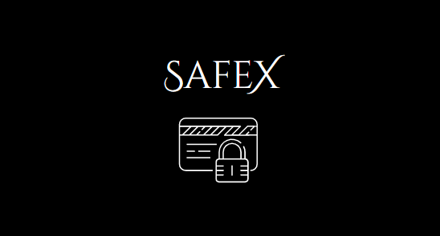

# Safe-X
# Safe-X Password Manager

 

## Overview
Safe-X is a Password Manager application built using Python, Tkinter, and MySQL. The application provides a secure and user-friendly interface for storing and managing passwords for various accounts. By leveraging encryption and secure database practices, Safe-X ensures that your sensitive information is kept safe and easily accessible.

## Features
- **User Authentication**: Secure login system to protect access to the password manager.
- **Password Storage**: Store passwords securely with encryption.
- **Password Generation**: Generate strong, random passwords.
- **Categorization**: Organize passwords into categories for easy management.
- **Search Functionality**: Quickly find stored passwords using a search feature.
- **Clipboard Copying**: Copy passwords to the clipboard for easy pasting.
- **Database Integration**: Use MySQL for robust and scalable data storage.

## Technologies Used
- **Python**: Core programming language used for application logic.
- **Tkinter**: Library used for building the graphical user interface (GUI).
- **MySQL**: Database management system for storing user data and passwords.

## Installation
1. Clone the repository:
   ```bash
   git clone https://github.com/yourusername/safe-x-password-manager.git
